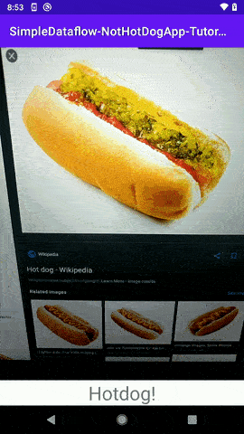

# Dataflow Tutorial: Build "Not Hotdog" Android app (from Silicon Valley TV series) that uses machine learning  
   
### Video tutorial: https://youtu.be/vzuU3XbbTOM

### Text tutorial: https://simpledataflow.com/dataflow-tutorial-build-not-hotdog-android-app-from-silicon-valley-tv-series-with-machine-learning/  

In the tutorial, you will create the application mentioned in the TV series “Silicon Valley”. This application allows you to see whether a meal is a hotdog or not.

